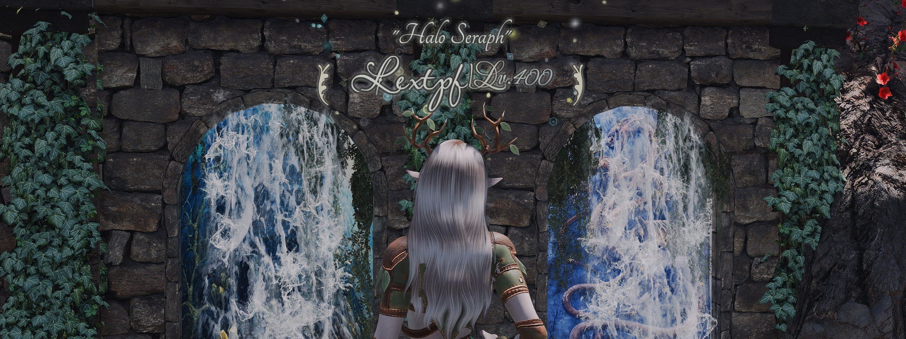
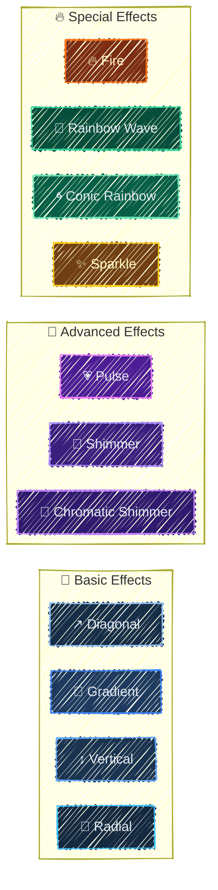
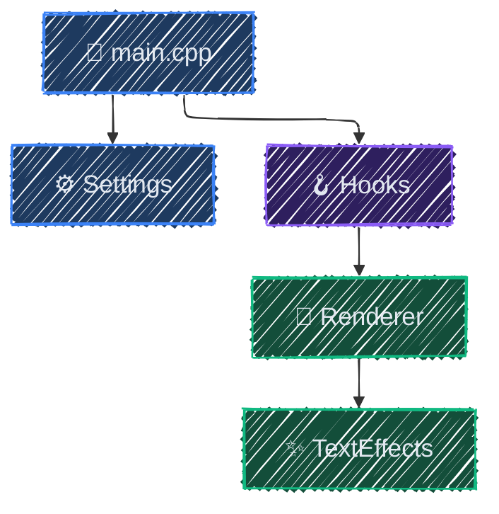

<div align="center">

# glyph
**SKSE overlay for actor info and appearance templates**

📖 [Installation](#installation) | 🎨 [Configuration](#configuration) | 🏗️ [Building](#building) | 🤝 [Contributing](./CONTRIBUTING.md)

![SKSE Plugin](https://img.shields.io/badge/SKSE-Plugin-4f46e5.svg?style=flat&logo=data:image/svg+xml;base64,PHN2ZyB3aWR0aD0iMTI4cHgiIGhlaWdodD0iMTI4cHgiIHZpZXdCb3g9IjAgMCAyNCAyNCIgZmlsbD0ibm9uZSIgeG1sbnM9Imh0dHA6Ly93d3cudzMub3JnLzIwMDAvc3ZnIiBzdHJva2U9IiNmZmZmZmYiPjxnIGlkPSJTVkdSZXBvX2JnQ2FycmllciIgc3Ryb2tlLXdpZHRoPSIwIj48L2c+PGcgaWQ9IlNWR1JlcG9fdHJhY2VyQ2FycmllciIgc3Ryb2tlLWxpbmVjYXA9InJvdW5kIiBzdHJva2UtbGluZWpvaW49InJvdW5kIj48L2c+PGcgaWQ9IlNWR1JlcG9faWNvbkNhcnJpZXIiPiA8cGF0aCBmaWxsLXJ1bGU9ImV2ZW5vZGQiIGNsaXAtcnVsZT0iZXZlbm9kZCIgZD0iTTEyIDJWN0wxMiA3LjA1NDQxQzExLjk5OTkgNy40Nzg0OCAxMS45OTk4IDcuODkwNiAxMi4wNDU1IDguMjMwNTJDMTIuMDk3IDguNjEzNzIgMTIuMjIyNiA5LjA1MSAxMi41ODU4IDkuNDE0MjFDMTIuOTQ5IDkuNzc3NDMgMTMuMzg2MyA5LjkwMjk1IDEzLjc2OTUgOS45NTQ0N0MxNC4xMDk0IDEwLjAwMDIgMTQuNTIxNSAxMC4wMDAxIDE0Ljk0NTYgMTBIMTQuOTQ1NkgxNC45NDU2SDE0Ljk0NTZMMTUgMTBIMjBWMTZDMjAgMTguODI4NCAyMCAyMC4yNDI2IDE5LjEyMTMgMjEuMTIxM0MxOC4yNDI2IDIyIDE2LjgyODQgMjIgMTQgMjJIMTBDNy4xNzE1NyAyMiA1Ljc1NzM2IDIyIDQuODc4NjggMjEuMTIxM0M0IDIwLjI0MjYgNCAxOC44Mjg0IDQgMTZWOEM0IDUuMTcxNTcgNCAzLjc1NzM2IDQuODc4NjggMi44Nzg2OEM1Ljc1NzM2IDIgNy4xNzE1NyAyIDEwIDJIMTJaTTE0IDIuMDA0NjJWN0MxNCA3LjQ5OTY3IDE0LjAwMjEgNy43NzM4MyAxNC4wMjc3IDcuOTY0MDJMMTQuMDI4NyA3Ljk3MTMxTDE0LjAzNiA3Ljk3MjMxQzE0LjIyNjIgNy45OTc4OCAxNC41MDAzIDggMTUgOEgxOS45OTU0QzE5Ljk4NTIgNy41ODgzNiAxOS45NTI1IDcuMzE1OTUgMTkuODQ3OCA3LjA2MzA2QzE5LjY5NTUgNi42OTU1MiAxOS40MDY1IDYuNDA2NDkgMTguODI4NCA1LjgyODQzTDE2LjE3MTYgMy4xNzE1N0MxNS41OTM1IDIuNTkzNTEgMTUuMzA0NSAyLjMwNDQ4IDE0LjkzNjkgMi4xNTIyNEMxNC42ODQgMi4wNDc0OSAxNC40MTE2IDIuMDE0ODEgMTQgMi4wMDQ2MlpNOCAxM0M4IDEyLjQ0NzcgOC40NDc3MiAxMiA5IDEyTDE1IDEyQzE1LjU1MjMgMTIgMTYgMTIuNDQ3NyAxNiAxM0MxNiAxMy41NTIzIDE1LjU1MjMgMTQgMTUgMTRMOSAxNEM4LjQ0NzcyIDE0IDggMTMuNTUyMyA4IDEzWk05IDE2QzguNDQ3NzIgMTYgOCAxNi40NDc3IDggMTdDOCAxNy41NTIzIDguNDQ3NzIgMTggOSAxOEgxM0MxMy41NTIzIDE4IDE0IDE3LjU1MjMgMTQgMTdDMTQgMTYuNDQ3NyAxMy41NTIzIDE2IDEzIDE2SDlaIiBmaWxsPSIjZmZmZmZmIj48L3BhdGg+IDwvZz48L3N2Zz4=)
![ImGui](https://img.shields.io/badge/ImGui-Overlay-0891b2.svg?style=flat&logo=data:image/svg+xml;base64,PHN2ZyBmaWxsPSIjZmZmZmZmIiB2ZXJzaW9uPSIxLjEiIHhtbG5zPSJodHRwOi8vd3d3LnczLm9yZy8yMDAwL3N2ZyIgeG1sbnM6eGxpbms9Imh0dHA6Ly93d3cudzMub3JnLzE5OTkveGxpbmsiIHdpZHRoPSIxMjhweCIgaGVpZ2h0PSIxMjhweCIgdmlld0JveD0iMCAwIDI4LjE1MiAyNS42ODMiIHhtbDpzcGFjZT0icHJlc2VydmUiIHN0cm9rZT0iI2ZmZmZmZiI+PGcgaWQ9IlNWR1JlcG9fYmdDYXJyaWVyIiBzdHJva2Utd2lkdGg9IjAiPjwvZz48ZyBpZD0iU1ZHUmVwb190cmFjZXJDYXJyaWVyIiBzdHJva2UtbGluZWNhcD0icm91bmQiIHN0cm9rZS1saW5lam9pbj0icm91bmQiPjwvZz48ZyBpZD0iU1ZHUmVwb19pY29uQ2FycmllciI+IDxnIGlkPSJvdmVybGF5Ij4gPHBhdGggZD0iTTEwLjYwNSwxNi45MzdjLTIuODI2LTEuMDktNS4wMTQtMy40NjMtNS44NDUtNi40MDZDMS45NiwxMS43NDUsMCwxNC41MzIsMCwxNy43NzljMCw0LjM2NiwzLjUzOCw3LjkwMyw3LjkwNCw3LjkwMyBjMS44NTQsMCwzLjU1Ni0wLjY0Myw0LjkwNC0xLjcxMmMtMS40LTEuNjgtMi4yNDYtMy44MzktMi4yNDYtNi4xOTFDMTAuNTYzLDE3LjQ5NSwxMC41ODEsMTcuMjE1LDEwLjYwNSwxNi45Mzd6Ij48L3BhdGg+IDxwYXRoIGQ9Ik0yMy4zOTIsMTAuNTI5Yy0xLjE0OCw0LjA2Ny00Ljg4NCw3LjA2Mi05LjMxNSw3LjA2MmMtMC41ODUsMC0xLjE1NC0wLjA2MS0xLjcxMi0wLjE2MSBjLTAuMDA2LDAuMTE3LTAuMDE4LDAuMjMxLTAuMDE4LDAuMzVjMCw0LjM2NiwzLjUzNyw3LjkwMyw3LjkwMyw3LjkwM2M0LjM2NCwwLDcuOTAyLTMuNTM3LDcuOTAyLTcuOTAzIEMyOC4xNTIsMTQuNTMyLDI2LjE5MiwxMS43NDUsMjMuMzkyLDEwLjUyOXoiPjwvcGF0aD4gPGNpcmNsZSBjeD0iMTQuMDc2IiBjeT0iNy45MDMiIHI9IjcuOTAzIj48L2NpcmNsZT4gPC9nPiA8ZyBpZD0iTGF5ZXJfMSI+IDwvZz4gPC9nPjwvc3ZnPg==)
![FreeType](https://img.shields.io/badge/%20-FreeType-4e7e1e.svg?style=flat&logo=data:image/svg+xml;base64,PHN2ZyB4bWxucz0iaHR0cDovL3d3dy53My5vcmcvMjAwMC9zdmciIHZpZXdCb3g9IjAgMCA2NDAgNjQwIj48IS0tIUZvbnQgQXdlc29tZSBQcm8gNy4zLjAgYnkgQGZvbnRhd2Vzb21lIC0gaHR0cHM6Ly9mb250YXdlc29tZS5jb20gTGljZW5zZSAtIGh0dHBzOi8vZm9udGF3ZXNvbWUuY29tL2xpY2Vuc2UgKENvbW1lcmNpYWwgTGljZW5zZSkgQ29weXJpZ2h0IDIwMjYgRm9udGljb25zLCBJbmMuLS0+PHBhdGggZmlsbD0iI2ZmZmZmZiIgZD0iTTk2IDE5Mkw5NiAxNjBMMTYwIDE2MEwxNjAgNDgwTDEyOCA0ODBDMTEwLjMgNDgwIDk2IDQ5NC4zIDk2IDUxMkM5NiA1MjkuNyAxMTAuMyA1NDQgMTI4IDU0NEwyNTYgNTQ0QzI3My43IDU0NCAyODggNTI5LjcgMjg4IDUxMkMyODggNDk0LjMgMjczLjcgNDgwIDI1NiA0ODBMMjI0IDQ4MEwyMjQgMTYwTDI4OCAxNjBMMjg4IDE5MkMyODggMjA5LjcgMzAyLjMgMjI0IDMyMCAyMjRDMzM3LjcgMjI0IDM1MiAyMDkuNyAzNTIgMTkyTDM1MiAxMzZDMzUyIDExMy45IDMzNC4xIDk2IDMxMiA5Nkw3MiA5NkM0OS45IDk2IDMyIDExMy45IDMyIDEzNkwzMiAxOTJDMzIgMjA5LjcgNDYuMyAyMjQgNjQgMjI0QzgxLjcgMjI0IDk2IDIwOS43IDk2IDE5MnpNMzUyIDM4NEwzNTIgMzUyTDQxNiAzNTJMNDE2IDQ4MEwzODQgNDgwQzM2Ni4zIDQ4MCAzNTIgNDk0LjMgMzUyIDUxMkMzNTIgNTI5LjcgMzY2LjMgNTQ0IDM4NCA1NDRMNTEyIDU0NEM1MjkuNyA1NDQgNTQ0IDUyOS43IDU0NCA1MTJDNTQ0IDQ5NC4zIDUyOS43IDQ4MCA1MTIgNDgwTDQ4MCA0ODBMNDgwIDM1Mkw1NDQgMzUyTDU0NCAzODRDNTQ0IDQwMS43IDU1OC4zIDQxNiA1NzYgNDE2QzU5My43IDQxNiA2MDggNDAxLjcgNjA4IDM4NEw2MDggMzI4QzYwOCAzMDUuOSA1OTAuMSAyODggNTY4IDI4OEwzMjggMjg4QzMwNS45IDI4OCAyODggMzA1LjkgMjg4IDMyOEwyODggMzg0QzI4OCA0MDEuNyAzMDIuMyA0MTYgMzIwIDQxNkMzMzcuNyA0MTYgMzUyIDQwMS43IDM1MiAzODR6Ii8+PC9zdmc+)
![CommonLibSSE-NG](https://img.shields.io/badge/CommonLib-SSE_NG-7c3aed.svg?style=flat&logo=data:image/svg+xml;base64,PHN2ZyB3aWR0aD0iMTY0cHgiIGhlaWdodD0iMTY0cHgiIHZpZXdCb3g9IjAgMCAyOC4wMCAyOC4wMCIgdmVyc2lvbj0iMS4xIiB4bWxucz0iaHR0cDovL3d3dy53My5vcmcvMjAwMC9zdmciIHhtbG5zOnhsaW5rPSJodHRwOi8vd3d3LnczLm9yZy8xOTk5L3hsaW5rIiBmaWxsPSIjZmZmZmZmIiBzdHJva2U9IiNmZmZmZmYiPjxnIGlkPSJTVkdSZXBvX2JnQ2FycmllciIgc3Ryb2tlLXdpZHRoPSIwIj48L2c+PGcgaWQ9IlNWR1JlcG9fdHJhY2VyQ2FycmllciIgc3Ryb2tlLWxpbmVjYXA9InJvdW5kIiBzdHJva2UtbGluZWpvaW49InJvdW5kIiBzdHJva2U9IiNDQ0NDQ0MiIHN0cm9rZS13aWR0aD0iMC4yMjQwMDAwMDAwMDAwMDAwMyI+PC9nPjxnIGlkPSJTVkdSZXBvX2ljb25DYXJyaWVyIj4gPCEtLSBVcGxvYWRlZCB0bzogU1ZHIFJlcG8sIHd3dy5zdmdyZXBvLmNvbSwgR2VuZXJhdG9yOiBTVkcgUmVwbyBNaXhlciBUb29scyAtLT4gPHRpdGxlPmljX2ZsdWVudF9saWJyYXJ5XzI4X2ZpbGxlZDwvdGl0bGU+IDxkZXNjPkNyZWF0ZWQgd2l0aCBTa2V0Y2guPC9kZXNjPiA8ZyBpZD0i8J+UjS1Qcm9kdWN0LUljb25zIiBzdHJva2Utd2lkdGg9IjAuMDAwMjgiIGZpbGw9Im5vbmUiIGZpbGwtcnVsZT0iZXZlbm9kZCI+IDxnIGlkPSJpY19mbHVlbnRfbGlicmFyeV8yOF9maWxsZWQiIGZpbGw9IiNmZmZmZmYiIGZpbGwtcnVsZT0ibm9uemVybyI+IDxwYXRoIGQ9Ik01Ljk4OTcsMyBDNy4wOTM3LDMgNy45ODk3LDMuODk2IDcuOTg5Nyw1IEw3Ljk4OTcsMjMgQzcuOTg5NywyNC4xMDQgNy4wOTM3LDI1IDUuOTg5NywyNSBMNC4wMDA3LDI1IEMyLjg5NTcsMjUgMi4wMDA3LDI0LjEwNCAyLjAwMDcsMjMgTDIuMDAwNyw1IEMyLjAwMDcsMy44OTYgMi44OTU3LDMgNC4wMDA3LDMgTDUuOTg5NywzIFogTTEyLjk4OTcsMyBDMTQuMDkzNywzIDE0Ljk4OTcsMy44OTYgMTQuOTg5Nyw1IEwxNC45ODk3LDIzIEMxNC45ODk3LDI0LjEwNCAxNC4wOTM3LDI1IDEyLjk4OTcsMjUgTDEwLjk5NDcsMjUgQzkuODg5NywyNSA4Ljk5NDcsMjQuMTA0IDguOTk0NywyMyBMOC45OTQ3LDUgQzguOTk0NywzLjg5NiA5Ljg4OTcsMyAxMC45OTQ3LDMgTDEyLjk4OTcsMyBaIE0yMi4wNzAxLDYuNTQzMiBMMjUuOTMwMSwyMi4wMjYyIEMyNi4xOTcxLDIzLjA5NzIgMjUuNTQ0MSwyNC4xODMyIDI0LjQ3MzEsMjQuNDUxMiBMMjIuNTEwMSwyNC45NDAyIEMyMS40MzkxLDI1LjIwNzIgMjAuMzUzMSwyNC41NTUyIDIwLjA4NjEsMjMuNDgzMiBMMTYuMjI2MSw4LjAwMDIgQzE1Ljk1ODEsNi45MjgyIDE2LjYxMTEsNS44NDMyIDE3LjY4MjEsNS41NzUyIEwxOS42NDUxLDUuMDg2MiBDMjAuNzE2MSw0LjgxODIgMjEuODAyMSw1LjQ3MTIgMjIuMDcwMSw2LjU0MzIgWiIgaWQ9IvCfjqgtQ29sb3IiPiA8L3BhdGg+IDwvZz4gPC9nPiA8L2c+PC9zdmc+)
![Skyrim](https://img.shields.io/badge/Skyrim-1.5.97-16a34a.svg?style=flat&logo=data:image/svg+xml;base64,PHN2ZyBmaWxsPSIjZmZmZmZmIiB3aWR0aD0iMTI4cHgiIGhlaWdodD0iMTI4cHgiIHZpZXdCb3g9IjAgLTY0IDY0MCA2NDAiIHhtbG5zPSJodHRwOi8vd3d3LnczLm9yZy8yMDAwL3N2ZyIgc3Ryb2tlPSIjZmZmZmZmIj48ZyBpZD0iU1ZHUmVwb19iZ0NhcnJpZXIiIHN0cm9rZS13aWR0aD0iMCI+PC9nPjxnIGlkPSJTVkdSZXBvX3RyYWNlckNhcnJpZXIiIHN0cm9rZS1saW5lY2FwPSJyb3VuZCIgc3Ryb2tlLWxpbmVqb2luPSJyb3VuZCI+PC9nPjxnIGlkPSJTVkdSZXBvX2ljb25DYXJyaWVyIj48cGF0aCBkPSJNMTguMzIgMjU1Ljc4TDE5MiAyMjMuOTZsLTkxLjI4IDY4LjY5Yy0xMC4wOCAxMC4wOC0yLjk0IDI3LjMxIDExLjMxIDI3LjMxaDIyMi43Yy05LjQ0LTI2LjQtMTQuNzMtNTQuNDctMTQuNzMtODMuMzh2LTQyLjI3bC0xMTkuNzMtODcuNmMtMjMuODItMTUuODgtNTUuMjktMTQuMDEtNzcuMDYgNC41OUw1LjgxIDIyNy42NGMtMTIuMzggMTAuMzMtMy40NSAzMC40MiAxMi41MSAyOC4xNHptNTU2Ljg3IDM0LjFsLTEwMC42Ni01MC4zMUE0Ny45OTIgNDcuOTkyIDAgMCAxIDQ0OCAxOTYuNjV2LTM2LjY5aDY0bDI4LjA5IDIyLjYzYzYgNiAxNC4xNCA5LjM3IDIyLjYzIDkuMzdoMzAuOTdhMzIgMzIgMCAwIDAgMjguNjItMTcuNjlsMTQuMzEtMjguNjJhMzIuMDA1IDMyLjAwNSAwIDAgMC0zLjAyLTMzLjUxbC03NC41My05OS4zOEM1NTMuMDIgNC43IDU0My41NCAwIDUzMy40NyAwSDI5Ni4wMmMtNy4xMyAwLTEwLjcgOC41Ny01LjY2IDEzLjYxTDM1MiA2My45NiAyOTIuNDIgODguOGMtNS45IDIuOTUtNS45IDExLjM2IDAgMTQuMzFMMzUyIDEyNy45NnYxMDguNjJjMCA3Mi4wOCAzNi4wMyAxMzkuMzkgOTYgMTc5LjM4LTE5NS41OSA2LjgxLTM0NC41NiA0MS4wMS00MzQuMSA2MC45MUM1Ljc4IDQ3OC42NyAwIDQ4NS44OCAwIDQ5NC4yIDAgNTA0IDcuOTUgNTEyIDE3Ljc2IDUxMmg0OTkuMDhjNjMuMjkuMDEgMTE5LjYxLTQ3LjU2IDEyMi45OS0xMTAuNzYgMi41Mi00Ny4yOC0yMi43My05MC40LTY0LjY0LTExMS4zNnpNNDg5LjE4IDY2LjI1bDQ1LjY1IDExLjQxYy0yLjc1IDEwLjkxLTEyLjQ3IDE4Ljg5LTI0LjEzIDE4LjI2LTEyLjk2LS43MS0yNS44NS0xMi41My0yMS41Mi0yOS42N3oiPjwvcGF0aD48L2c+PC9zdmc+)

![License](https://img.shields.io/badge/License-MIT-475569.svg?logo=data:image/svg+xml;base64,PHN2ZyBmaWxsPSIjZmZmZmZmIiB3aWR0aD0iMTY0cHgiIGhlaWdodD0iMTY0cHgiIHZpZXdCb3g9IjAgMCA1MTIuMDAgNTEyLjAwIiB4bWxucz0iaHR0cDovL3d3dy53My5vcmcvMjAwMC9zdmciIHN0cm9rZT0iI2ZmZmZmZiIgc3Ryb2tlLXdpZHRoPSIwLjAwNTEyIj48ZyBpZD0iU1ZHUmVwb19iZ0NhcnJpZXIiIHN0cm9rZS13aWR0aD0iMCI+PC9nPjxnIGlkPSJTVkdSZXBvX3RyYWNlckNhcnJpZXIiIHN0cm9rZS1saW5lY2FwPSJyb3VuZCIgc3Ryb2tlLWxpbmVqb2luPSJyb3VuZCIgc3Ryb2tlPSIjQ0NDQ0NDIiBzdHJva2Utd2lkdGg9IjMuMDcyIj48L2c+PGcgaWQ9IlNWR1JlcG9faWNvbkNhcnJpZXIiPjxwYXRoIGQ9Ik0yNTYgOEMxMTkuMDMzIDggOCAxMTkuMDMzIDggMjU2czExMS4wMzMgMjQ4IDI0OCAyNDggMjQ4LTExMS4wMzMgMjQ4LTI0OFMzOTIuOTY3IDggMjU2IDh6bTExNy4xMzQgMzQ2Ljc1M2MtMS41OTIgMS44NjctMzkuNzc2IDQ1LjczMS0xMDkuODUxIDQ1LjczMS04NC42OTIgMC0xNDQuNDg0LTYzLjI2LTE0NC40ODQtMTQ1LjU2NyAwLTgxLjMwMyA2Mi4wMDQtMTQzLjQwMSAxNDMuNzYyLTE0My40MDEgNjYuOTU3IDAgMTAxLjk2NSAzNy4zMTUgMTAzLjQyMiAzOC45MDRhMTIgMTIgMCAwIDEgMS4yMzggMTQuNjIzbC0yMi4zOCAzNC42NTVjLTQuMDQ5IDYuMjY3LTEyLjc3NCA3LjM1MS0xOC4yMzQgMi4yOTUtLjIzMy0uMjE0LTI2LjUyOS0yMy44OC02MS44OC0yMy44OC00Ni4xMTYgMC03My45MTYgMzMuNTc1LTczLjkxNiA3Ni4wODIgMCAzOS42MDIgMjUuNTE0IDc5LjY5MiA3NC4yNzcgNzkuNjkyIDM4LjY5NyAwIDY1LjI4LTI4LjMzOCA2NS41NDQtMjguNjI1IDUuMTMyLTUuNTY1IDE0LjA1OS01LjAzMyAxOC41MDggMS4wNTNsMjQuNTQ3IDMzLjU3MmExMi4wMDEgMTIuMDAxIDAgMCAxLS41NTMgMTQuODY2eiI+PC9wYXRoPjwvZz48L3N2Zz4=)
<br/>
[](https://sonarcloud.io/summary/new_code?id=lextpf_whois)
[](https://sonarcloud.io/summary/new_code?id=lextpf_whois)
[](https://sonarcloud.io/summary/new_code?id=lextpf_whois)
[](https://app.codacy.com/gh/lextpf/glyph/dashboard?utm_source=gh&utm_medium=referral&utm_content=&utm_campaign=Badge_grade)
<br/>
[](https://github.com/lextpf/glyph/actions/workflows/build.yml)
[](https://github.com/lextpf/glyph/actions/workflows/test.yml)
<br/>
![Sponsor](https://img.shields.io/static/v1?label=sponsor&message=%E2%9D%A4&color=ff69b4&logo=data:image/svg+xml;base64,PHN2ZyB4bWxucz0iaHR0cDovL3d3dy53My5vcmcvMjAwMC9zdmciIHZpZXdCb3g9IjAgMCA2NDAgNjQwIj48IS0tIUZvbnQgQXdlc29tZSBQcm8gdjcuMi4wIGJ5IEBmb250YXdlc29tZSAtIGh0dHBzOi8vZm9udGF3ZXNvbWUuY29tIExpY2Vuc2UgLSBodHRwczovL2ZvbnRhd2Vzb21lLmNvbS9saWNlbnNlIChDb21tZXJjaWFsIExpY2Vuc2UpIENvcHlyaWdodCAyMDI2IEZvbnRpY29ucywgSW5jLi0tPjxwYXRoIG9wYWNpdHk9IjEiIGZpbGw9IiNmZjY5YjRmZiIgZD0iTTMyIDQ4MEwzMiA1NDRDMzIgNTYxLjcgNDYuMyA1NzYgNjQgNTc2TDM4NC41IDU3NkM0MTMuNSA1NzYgNDQxLjggNTY2LjcgNDY1LjIgNTQ5LjVMNTkxLjggNDU2LjJDNjA5LjYgNDQzLjEgNjEzLjQgNDE4LjEgNjAwLjMgNDAwLjNDNTg3LjIgMzgyLjUgNTYyLjIgMzc4LjcgNTQ0LjQgMzkxLjhMNDI0LjYgNDgwTDMxMiA0ODBDMjk4LjcgNDgwIDI4OCA0NjkuMyAyODggNDU2QzI4OCA0NDIuNyAyOTguNyA0MzIgMzEyIDQzMkwzODQgNDMyQzQwMS43IDQzMiA0MTYgNDE3LjcgNDE2IDQwMEM0MTYgMzgyLjMgNDAxLjcgMzY4IDM4NCAzNjhMMjMxLjggMzY4QzE5Ny45IDM2OCAxNjUuMyAzODEuNSAxNDEuMyA0MDUuNUw5OC43IDQ0OEw2NCA0NDhDNDYuMyA0NDggMzIgNDYyLjMgMzIgNDgweiIvPjxwYXRoIGZpbGw9InJnYmEoMjU1LCAyNTUsIDI1NSwgMS4wMCkiIGQ9Ik0yNTAuOSA2NEMyNzQuOSA2NCAyOTcuNSA3NS41IDMxMS42IDk1TDMyMCAxMDYuN0wzMjguNCA5NUMzNDIuNSA3NS41IDM2NS4xIDY0IDM4OS4xIDY0QzQzMC41IDY0IDQ2NCA5Ny41IDQ2NCAxMzguOUw0NjQgMTQxLjNDNDY0IDIwNS43IDM4MiAyNzQuNyAzNDEuOCAzMDQuNkMzMjguOCAzMTQuMyAzMTEuMyAzMTQuMyAyOTguMyAzMDQuNkMyNTguMSAyNzQuNiAxNzYgMjA1LjcgMTc2LjEgMTQxLjNMMTc2LjEgMTM4LjlDMTc2IDk3LjUgMjA5LjUgNjQgMjUwLjkgNjR6Ii8+PC9zdmc+)
</div>

An SKSE plugin that renders **floating nameplates** above NPCs and creatures, displaying *names*, *levels*, and *custom titles*. Features a **tier system** that assigns unique visual styles based on level, from simple gradients to **shimmering rainbows** and **particle auras**. Every aspect is customizable: *fonts*, *colors*, *effects*, *distance fading*, and more.

<div align="center">
<br>



</div>

> [!IMPORTANT]
> **Skyrim SE 1.5.97** - AE support is available but untested.
>
> - Built and tested against **Nolvus Awakening 6.0.20**. The deploy script assumes `D:\Nolvus\Instance\MODS\overwrite`, edit `DEPLOY_PATH` in `deploy.bat` to match your setup.
> - If you experience frame drops, type `glyph` in the console to toggle the overlay off.

```
/* ============================================================================================== *
 *                                                             ⠀    ⠀⠀⡄⠀⠀⠀⠀⠀⠀⣠⠀⠀⢀⠀⠀⢠⠀⠀⠀
 *                                                             ⠀     ⢸⣧⠀⠀⠀⠀⢠⣾⣇⣀⣴⣿⠀⠀⣼⡇⠀⠀
 *                                                                ⠀⠀⣾⣿⣧⠀⠀⢀⣼⣿⣿⣿⣿⣿⠀⣼⣿⣷⠀⠀
 *                                                                ⠀⢸⣿⣿⣿⡀⠀⠸⠿⠿⣿⣿⣿⡟⢀⣿⣿⣿⡇⠀
 *        ::::::::  :::     :::   ::: :::::::::  :::    :::       ⠀⣾⣿⣿⣿⣿⡀⠀⢀⣼⣿⣿⡿⠁⣿⣿⣿⣿⣷⠀
 *       :+:    :+: :+:     :+:   :+: :+:    :+: :+:    :+:       ⢸⣿⣿⣿⣿⠁⣠⣤⣾⣿⣿⣯⣤⣄⠙⣿⣿⣿⣿⡇
 *       +:+        +:+      +:+ +:+  +:+    +:+ +:+    +:+       ⣿⣿⣿⣿⣿⣶⣿⣿⣿⣿⣿⣿⣿⣿⣶⣿⣿⣿⣿⣿
 *       :#:        +#+       +#++:   +#++:++#+  +#++:++#++       ⠘⢿⣿⣿⣿⣿⣿⣿⣿⣿⣿⣿⣿⣿⣿⣿⣿⣿⣿⡏
 *       +#+   +#+# +#+        +#+    +#+        +#+    +#+       ⠀⠘⢿⣿⣿⣿⠛⠻⢿⣿⣿⣿⠹⠟⣿⣿⣿⣿⣿⠀
 *       #+#    #+# #+#        #+#    #+#        #+#    #+#       ⠀⠀⠘⢿⣿⣿⣦⡄⢸⣿⣿⣿⡇⠠⣿⣿⣿⣿⡇⠀
 *        ########  ########## ###    ###        ###    ###       ⠀⠀⠀⠘⢿⣿⣿⠀⣸⣿⣿⣿⠇⠀⠙⣿⣿⣿⠁⠀
 *                                                                ⠀⠀⠀⠀⠘⣿⠃⢰⣿⣿⣿⡇⠀⠀⠀⠈⢻⡇⠀⠀
 *                                                                ⠀⠀⠀⠀⠀⠈⠀⠈⢿⣿⣿⣿⣶⡶⠂⠀⠀⠁⠀⠀
 *                                << S K Y R I M   P L U G I N >>         ⠀⠀⠈⠻⣿⡿⠋⠀⠀⠀⠀⠀⠀⠀
 *                                                                                                  
 * ============================================================================================== */
```

```
glyph/
|-- src/                                     # Plugin source (C++23)
|   |-- main.cpp                             # SKSEPlugin_Load, lifecycle, message listener
|   |-- Hooks.cpp/hpp                        # D3D11 device, HUDMenu::PostDisplay, Present
|   |-- GameState.cpp/hpp                    # CanDrawOverlay gate (menus, combat, cell)
|   |-- ConsoleCommands.cpp/hpp              # `glyph` console command
|   |-- Renderer.cpp/hpp                     # World-to-screen projection, shared entry
|   |-- RendererSnapshot.cpp                 # Game thread: scan actors, publish snapshot
|   |-- RendererLayout.cpp                   # Render thread: projection, smoothing, layout
|   |-- RendererEffects.cpp                  # Render thread: outline, glow, particles
|   |-- RendererInternal.hpp                 # Shared render-thread state and types
|   |-- RenderConstants.hpp                  # Compile-time rendering constants
|   |-- TextEffects.hpp                      # Public text-effects API
|   |-- TextEffectsCore.cpp                  # Outline/glow infra + vertex capture
|   |-- TextEffectsGradient.cpp              # Static spatial gradients
|   |-- TextEffectsAnimated.cpp              # Time-based per-vertex modulation
|   |-- TextEffectsComplex.cpp               # FBM/noise effects, bloom, soft shadow
|   |-- TextEffectsParticle.cpp              # Particle auras (weather sprites)
|   |-- TextEffectsInternal.hpp              # Shared effect helpers
|   |-- TextPostProcess.cpp/hpp              # Shared post-process passes
|   |-- Settings.cpp/hpp                     # INI parsing and configuration
|   |-- SettingsBinding.hpp                  # Declarative kSettings descriptor table
|   |-- AppearanceTemplate.cpp/hpp           # Orchestrator: copy NPC look to player
|   |-- AppearanceTemplateInternal.hpp       # Shared appearance-copy internals
|   |-- AppearanceCopy.cpp                   # Head parts, tint layers, morphs
|   |-- AppearanceFaceGen.cpp                # Baked FaceGen NIF/DDS load
|   |-- AppearanceFormID.cpp                 # Load-order / ESL FormID resolution
|   |-- OutfitCopy.cpp/hpp                   # Equipped-outfit copy
|   |-- ParticleTextures.cpp/hpp             # Sprite loading + procedural fallback
|   |-- BadgeTextures.cpp/hpp                # Duotone SVG rasterization for badges
|   |-- Occlusion.cpp/hpp                    # Line-of-sight culling
|   |-- DepthClip.cpp/hpp                    # Per-pixel depth occlusion
|   |-- SceneMeter.cpp/hpp                   # Candlelight exposure metering
|   |-- HudCompat.cpp/hpp                    # TrueHUD / moreHUD deconfliction
|   |-- TrueHUDAPI.h                         # TrueHUD public API (third-party)
|   |-- DebugOverlay.cpp/hpp                 # Performance/cache debug HUD
|   |-- Utf8Utils.hpp                        # UTF-8 helpers
|   |-- PCH.hpp                              # Precompiled header
|   +-- Version.hpp                          # Plugin version
|-- tests/                                   # GoogleTest suites (pure logic, no game deps)
|   |-- test_settings.cpp
|   |-- test_label_format.cpp
|   +-- test_utils.cpp
|-- scripts/                                 # Build & doc helper scripts
|   |-- _normalize_compile_db.py             # clang-cl compile-db fixup
|   |-- _promote_subgroups.py                # doxide doc post-processing
|   +-- _clean_docs.py
|-- glyph.ini                                # Default configuration
|-- glyph.project.json                       # Asset manifest (GUID -> role/token map)
|-- assets/                                  # Runtime assets (deployed as SKSE/Plugins/glyph/)
|   |-- badges/                              # Tier emblem PNGs
|   |-- fonts/                               # Default fonts (not redistributed)
|   |-- particles/                           # Sprite PNGs (not bundled; procedural fallback)
|   +-- duotone/                             # Badge SVGs (not bundled; Font Awesome Pro)
|-- external/                                # Third-party sources (NiOverride API, SKSE64)
|-- CMakeLists.txt                           # Build configuration
|-- CMakePresets.json                        # CMake presets & toolchain
|-- vcpkg.json                               # vcpkg dependencies
|-- build.bat                                # Format, configure, tidy, build, docs
|-- deploy.bat                               # Package + install as MO2 mod
|-- test.bat                                 # Build & run unit tests
|-- doxide.yml                               # API doc generation config
+-- mkdocs.yml                               # Docs site config
```

## Features

### Visual Effects System



- **Gradients** - Horizontal, vertical, diagonal, and radial color blending
- **Shimmer** - Moving highlight bands with chromatic aberration option
- **Rainbow** - Animated wave and conic rainbow patterns
- **Fire/Sparkle** - Dynamic elemental effects for legendary tiers

### Tier System

Customizable tiers with unique visual styles per level range. Tier palettes
and effects style the **player** nameplate (and special titles); NPCs render
simple white-leaning text so the world stays readable (see *NPC Colors*).

| Tier |   Default Title   | Style                      |
|------|-------------------|----------------------------|
|  0-4 | 🌿 Lost Wanderer | Simple gradient            |
|  4-8 |   ⚔️ Apprentice  | Progressive effects        |
| 8-12 |    🛡️ Radiant    | Ornaments + particles      |
|  12+ |     👑 Legend    | Full rainbow + all effects |

### Rendering Features

- 🌫️ **Distance-based fading** - Smooth alpha and scale transitions
- 🧱 **Occlusion culling** - Names hidden behind walls
- 🌟 **Glow effects** - Soft bloom for readability
- ⌨️ **Typewriter reveal** - Characters appear one-by-one
- 🌿 **Side ornaments** - Ornate scrollwork for high tiers
- ✨ **Particle auras** - 42 families of hand-made pixel-art sprites, assigned by tier:
  - **Weather** - fireflies, rain, snow, smoke, sparks, wisps, leaves, aurora, cherry blossoms, dust, motes
  - **Arcane** - runes, enchant sparkles, hexes, curses, morphing glyphs, gems, glitter, void swirls, vortices, lightning zaps
  - **Sky & nature** - butterflies, fairies, bats, pollen, fog, gusting sand, wind, a moon, a ringed planet, constellations
  - **Whimsy** - bubbles (they pop), coins, confetti, hearts, ink, pixie dust, souls, steam, rising embers, ash, sleepy Zzz's

  Each family moves by one archetype - **orbit** (a tilted 3D ring, front-of-ring sprites drawn larger and brighter), **rise**, **fall**, **flow**, **twinkle**, or **strike**. Many carry 4-frame animation strips (wing flaps, coin spins, twinkles) on a stateless per-particle flipbook clock, and multi-variant families (`smoke`/`smoke2`/`smoke3`) spread their variants evenly across particles.

### Presentation Choreography

- 🎬 **The Roll Call** - When the overlay wakes - combat ends, a menu
  closes, a cell loads, F7 reloads - plates re-enter as a staggered
  near-to-far cascade rather than a simultaneous pop: the innkeeper first,
  the guard on the wall last. `EntranceStaggerStep` / `EntranceStaggerMax`.
- 🤫 **The Quiet Frame** - During fast camera pans, sub-lines (title, info,
  level, badges) fold away and names thin to a low-alpha trace. When the
  camera settles, names resolve first and the sub-lines breathe back in -
  quick to recede, slow and weighty to return. `[Quiet]`.
- 🕯️ **Last Rites** - An actor that dies in view earns a one-shot farewell:
  the plate holds still, the ink drains to ash, and the name gutters out and
  sinks (mortals), crumbles letter by letter (draugr), or sears bright before
  going dark (dragons). Corpses first seen dead never get a plate, and rites
  never replay after your own combat. `[DeathRite]`.
- 🗡️ **Cut by the World** - Plates are depth-tested per pixel against the
  game's own depth buffer, so a doorframe physically slices a name as an
  actor steps behind it - no whole-plate popping. Falls back to LOS-only
  occlusion where the depth buffer is unreachable. `[DepthClip]`.
- 🕯️ **Candlelight Metering** - The ink sits in the scene's own light: a
  touch dimmer over bright snowfields, a few percent lifted (with a whisper
  of scene warmth) in torchlit crypts. Capped at ±8% by default.
  `[Candlelight]`.

### Living Titles & Scene Awareness

- 🏅 **Deeds, Not Words** - `[HonorificN]` sections derive titles from
  faction membership and rank, so "Of the Circle" appears the moment the
  deed is done - on the player *and* on NPC members of the same faction.
  Special titles still take precedence.

  *Keys:* `Faction = 0xFORMID[@Plugin.esp]`, `MinRank`, `Title`, `Priority`,
  `PlayerOnly` / `NpcOnly`.
- 🎚️ **Registers** - `[RegisterN]` sections bind a small knob set to scene
  predicates, so the overlay swells and recedes with the scene over
  `RegisterTransitionTime` seconds - dimmer at night, sparser in a packed city.

  *Knobs:* `AlphaMultiplier`, `FadeDistanceMultiplier`,
  `SubLineAlphaMultiplier`, `HideNeutral`, `Priority`.

  *Predicate:* `When = exterior, night` - tokens `interior`, `exterior`,
  `night`, `day`, `city`, `sneaking`, `dialogue`, `crowded` (`!` negates).
- 🤝 **One Voice Per Actor** - Automatic HUD deconfliction. When TrueHUD
  floats an info/boss bar over an actor, glyph yields that plate (fading to
  `CompatTrueHUDYieldAlpha` and back, synchronized). When moreHUD's crosshair
  readout already shows the target's level, glyph drops its own level segment.
  Absent mods change nothing - zero patching. `[Compat]`.

## Technology Stack

| Component      | Technology      |
|----------------|-----------------|
| Language       | C++23           |
| Graphics       | D3D11           |
| Overlay        | ImGui           |
| Font Rendering | FreeType 2      |
| Assembly       | xbyak           |
| Framework      | CommonLibSSE-NG |
| Logging        | spdlog          |

## Installation

**Requirements:** Skyrim SE 1.5.97, [SKSE64](https://skse.silverlock.org/),
and the [Address Library for SKSE Plugins](https://www.nexusmods.com/skyrimspecialedition/mods/32444).

`deploy.bat` packages the build into the layout below (or assemble it by
hand), then install the archive with a mod manager:

- **Mod Organizer 2** - install from archive, then enable.
- **Vortex** - drag in the archive, then deploy.

```
Data/SKSE/Plugins/
|-- glyph.dll             # the plugin
|-- glyph.ini             # configuration (hot-reload in-game with F7)
|-- glyph.project.json    # asset manifest (maps roles/tokens -> asset files)
+-- glyph/                # runtime assets
    |-- badges/           # tier emblem PNGs
    |-- duotone/          # status-icon SVGs
    |-- fonts/            # name / level / title / ornament fonts
    +-- particles/        # aura sprite PNGs
```

> **📝 Assets aren't in the repo.** The `glyph/` art (icons, fonts, sprites,
> emblems) is licensed or non-redistributed, so it ships in a release archive
> rather than the source tree. glyph still loads without it - particle
> sprites fall back to procedural rendering - and you can point `IconFolder`,
> `TierBadgeFolder`, and the `*FontPath` keys at your own art.

## Configuration

Edit `Data/SKSE/Plugins/glyph.ini` — press **F7** in-game to hot reload.

```mermaid
---
config:
  look: handDrawn
  theme: mc
  themeVariables:
    fontSize: 18px
  layout: elk
---
graph LR
    classDef display fill:#1e3a5f,stroke:#3b82f6,color:#e2e8f0
    classDef distance fill:#1a3350,stroke:#60a5fa,color:#e2e8f0
    classDef effects fill:#3b1f7e,stroke:#a78bfa,color:#e2e8f0
    classDef particles fill:#2e1a6e,stroke:#c084fc,color:#e2e8f0
    classDef tiers fill:#064e3b,stroke:#34d399,color:#e2e8f0
    classDef template fill:#7c2d12,stroke:#f97316,color:#fef3c7

    subgraph Display["📝 Display"]
        FMT["📋 Format"]:::display
        FONT["🔤 Fonts"]:::display
        VERT["📐 VerticalOffset"]:::display
    end

    subgraph Distance["📏 Distance & Fade"]
        FADE["🌫️ FadeStart/End"]:::distance
        SCALE["🔍 ScaleStart/End"]:::distance
        SCAN["📡 MaxScanDistance"]:::distance
    end

    subgraph Effects["✨ Visual Effects"]
        GLOW["🌟 Glow"]:::effects
        TYPE["⌨️ Typewriter"]:::effects
        ORNA["🌿 Ornaments"]:::effects
    end

    subgraph Particles["💫 Particle Aura"]
        FIREFLY["🪰 Firefly"]:::particles
        RAINSNOW["🌧️ Rain / Snow"]:::particles
        SMOKE["💨 Smoke / Spark"]:::particles
        FLORA["🍃 Leaf / Cherry blossom"]:::particles
        AURORA["🌌 Aurora / Wisp / Mote"]:::particles
    end

    subgraph Tiers["🏅 Tier Definitions"]
        TIER["🎨 Colors & Effects"]:::tiers
        LEVEL["📊 Level Ranges"]:::tiers
    end

    subgraph Template["👤 Appearance"]
        NPC["🧝 TemplateFormID"]:::template
        PLUGIN["📦 TemplatePlugin"]:::template
    end
```



### 🎨 NPC Colors

NPC nameplates use flat, white-leaning text; the tier palettes apply only
to the player and special titles. The name color follows the actor's
relationship to the player, so merely talkable civilians stay plain white.

| Setting            | Default            | Applies to                       |
|--------------------|--------------------|----------------------------------|
| `NpcNeutralColor`  | `1.0, 1.0, 1.0`    | ⚪ Neutral + talkable civilians  |
| `NpcHostileColor`  | `1.0, 0.72, 0.68`  | 🔴 Hostiles (slight warm lean)   |
| `NpcFollowerColor` | `0.72, 0.84, 1.0`  | 🔵 Teammates (slight cool lean)  |
| `NpcLevelColor`    | `0.82, 0.84, 0.88` | 🩶 Dimmed silver level readout   |
| `NpcTitleColor`    | `0.92, 0.93, 0.95` | ⬜ Soft white title text         |

### 🏷️ Status Icon Badges

Relationship, threat, and creature type render as a compact strip of icons
above the name (replacing the old text info row).
Icons are [Font Awesome](https://fontawesome.com/) **duotone SVGs**
rasterized at load time (via nanosvg) from `IconFolder`: each `Icon*`
value is an SVG file name without the extension, so any icon dropped into
the folder works. Duotone layer opacities are preserved, and the badge's
semantic color is applied as a tint.

> **📝 Note:** the duotone icon set used during development is Font Awesome
> Pro and is **not** part of this repository. Point `IconFolder` at any
> folder of FA-style SVGs (Font Awesome Free's duotone-compatible SVG
> downloads work too).

**⚙️ Badge settings**

```ini
[Icons]
IconFolder      = Data/SKSE/Plugins/glyph/duotone
IconsEnabled    = true
IconScale       = 1.0         ; badge size relative to the level font
IconDeadlyPulse = true        ; subtle pulse on the Deadly skull
IconOpacity     = 1.15        ; lit-icon opacity gain, 0.5-2.0 (muted slots use IconMutedAlpha)
```

**🧩 Badge icons** render left-to-right - relationship, then threat, then
creature. Leave any value empty to hide that badge.

| Category        | Setting        | Default icon       | Tint             |
|-----------------|----------------|--------------------|------------------|
| 🤝 Relationship | `IconFollower` | `shield-halved`    | 🔵 Light blue    |
| 🤝 Relationship | `IconAlly`     | `handshake`        | 🟢 Green         |
| 🤝 Relationship | `IconHostile`  | `skull-crossbones` | 🔴 Red           |
| ⚔️ Threat       | `IconWeak`     | `caret-down`       | 🩶 Gray          |
| ⚔️ Threat       | `IconStrong`   | `caret-up`         | 🟠 Orange        |
| ⚔️ Threat       | `IconDeadly`   | `skull`            | 🔴 Red (pulsing) |
| 🐾 Creature     | `IconBeast`    | `paw`              | 🟡 Warm tan      |
| 🐾 Creature     | `IconUndead`   | `ghost`            | 🟡 Warm tan      |
| 🐾 Creature     | `IconDaedra`   | `fire`             | 🟡 Warm tan      |
| 🐾 Creature     | `IconDragon`   | `dragon`           | 🟡 Warm tan      |

Each badge takes an `R,G,B` float color: `IconFollowerColor`,
`IconAllyColor`, `IconHostileColor`, `IconWeakColor`, `IconStrongColor`,
`IconDeadlyColor`, and one shared `IconCreatureColor` for all creature
types.

**👑 Player row** - the player's strip shows five slots, left to right:
**tier prestige**, sneak, engagement, encumbered, and bounty. The prestige
badge tracks the `[TierN]` ladder and is always lit - `IconTierLow` (`medal`,
bronze), `IconTierMid` (`gem`, silver-blue), `IconTierHigh` (`crown`, gold)
for the low / mid / high third. Toggle with `IconTierEnabled`; recolor with
`IconTierLowColor` / `IconTierMidColor` / `IconTierHighColor`.

📜 The legacy text row is still available: set `InfoFormat` explicitly
(e.g. `InfoFormat = "%r?","  • %d?","  • %c?"`) and it renders as before.

## Building

### Prerequisites

- CMake 3.10+
- C++23 compatible compiler (MSVC 2022+)
- vcpkg
- Skyrim SE 1.5.97
- SKSE64
- Address Library for SKSE Plugins

### Windows

```powershell
# 1. Clone the repository
git clone https://github.com/lextpf/glyph.git
cd glyph

# 2. Build
.\build.bat

# 3. Deploy to Skyrim (adjust path in deploy.bat)
.\deploy.bat
```

Output: `build/Release/glyph.dll`

## Architecture



|              File | Purpose                               |
|-------------------|---------------------------------------|
|        `main.cpp` | Plugin initialization, SKSE interface |
|       `Hooks.cpp` | D3D11 and HUD menu hooks              |
|    `Renderer.cpp` | World-to-screen projection, tracking  |
|    `Settings.cpp` | INI parsing and configuration         |
| `TextEffects.cpp` | Visual effect implementations         |

## Troubleshooting

|            Problem | Solution                                           |
|--------------------|----------------------------------------------------|
| Names don't appear | Check SKSE is loaded (`getskseversion` in console) |
| No names in combat | Intended behavior - overlay disabled during combat |
| Performance issues | Reduce `MaxScanDistance`, disable complex effects  |
|  Fonts not loading | Verify paths in INI, ensure TTF format             |

Check `Documents/My Games/Skyrim Special Edition/SKSE/glyph.log` for errors.

## Contributing

Contributions are welcome! Please read the [Contributing Guidelines](CONTRIBUTING.md) before submitting pull requests.

### Development Workflow

1. Fork the repository
2. Create a feature branch (`git checkout -b feature/amazing-feature`)
3. Make your changes
4. ~~Run tests and~~ ensure the build passes
5. Commit with descriptive messages
6. Push to your fork and open a Pull Request

## License

This project is licensed under the MIT License - see the [LICENSE](LICENSE.md) file for details.

## Acknowledgments

- [SKSE Team](https://skse.silverlock.org/) - Script extender framework
- [CommonLibSSE-NG](https://github.com/CharmedBaryon/CommonLibSSE-NG) - SKSE plugin library
- [ImGui](https://github.com/ocornut/imgui) - Immediate mode GUI
- [FreeType](https://freetype.org/) - Font rendering
- [spdlog](https://github.com/gabime/spdlog) - Logging library
- [xbyak](https://github.com/herumi/xbyak) - JIT assembler
- [Claude](https://claude.ai/) - AI coding assistant by Anthropic
- [Codex](https://openai.com/index/openai-codex/) - AI coding assistant by OpenAI
- [Sora](https://openai.com/sora/) - Graphics generation
- [Font Awesome](https://fontawesome.com/) - Status badge icon artwork (duotone SVGs; Pro assets are not redistributed with this project)
- [NanoSVG](https://github.com/memononen/nanosvg) - SVG parsing and rasterization for badge icons


